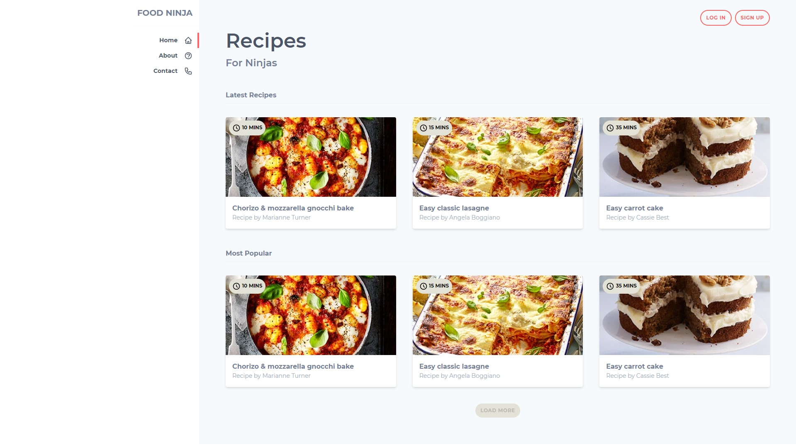
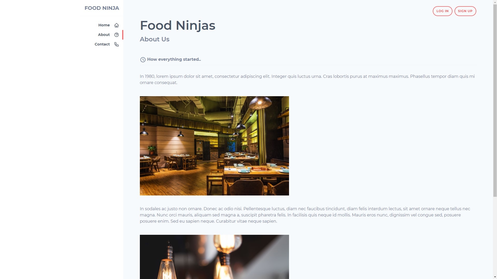
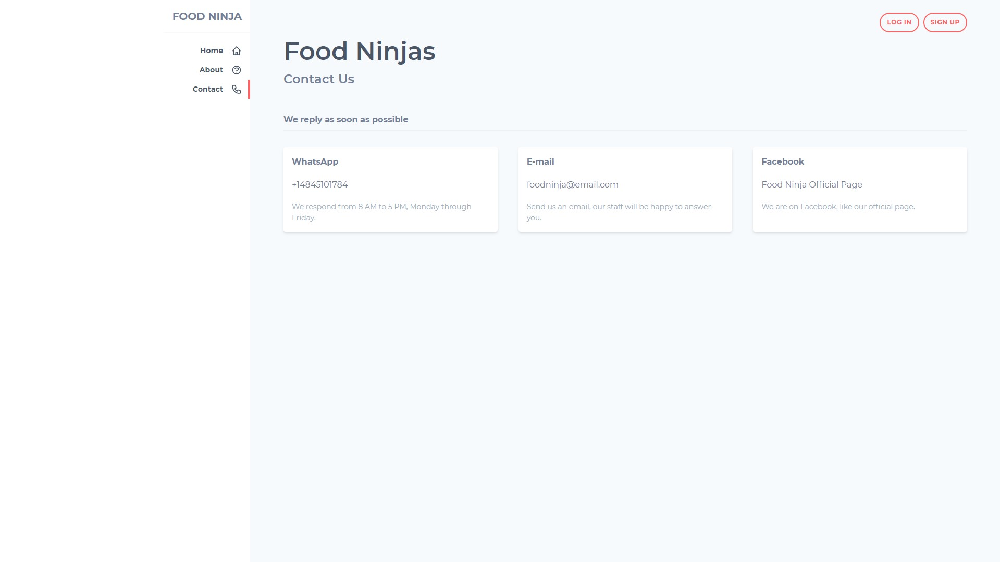

# Food Ninja [](https://app.netlify.com/sites/food-ninja-jonasmarco/deploys)
## Demo project made with Tailwind CSS

Inspired by: https://www.youtube.com/playlist?list=PL4cUxeGkcC9gpXORlEHjc5bgnIi5HEGhw

### Live demo: https://food-ninja-jonasmarco.netlify.app/

This project was made with:

  * [Tailwind CSS](https://tailwindcss.com/docs/installation)
  * [Heroicons](https://heroicons.dev/)
  * And ❤️

## How to run?
 ```javascript
	git clone https://github.com/jonasmarco/food-ninja
	cd food-ninja
	npm i
	npm run build-css
	open public/index.html on browser
	it's done!
```
:smiley:

### Some screenshots

 * Home Desktop



 * About Desktop



 * Contact Desktop


